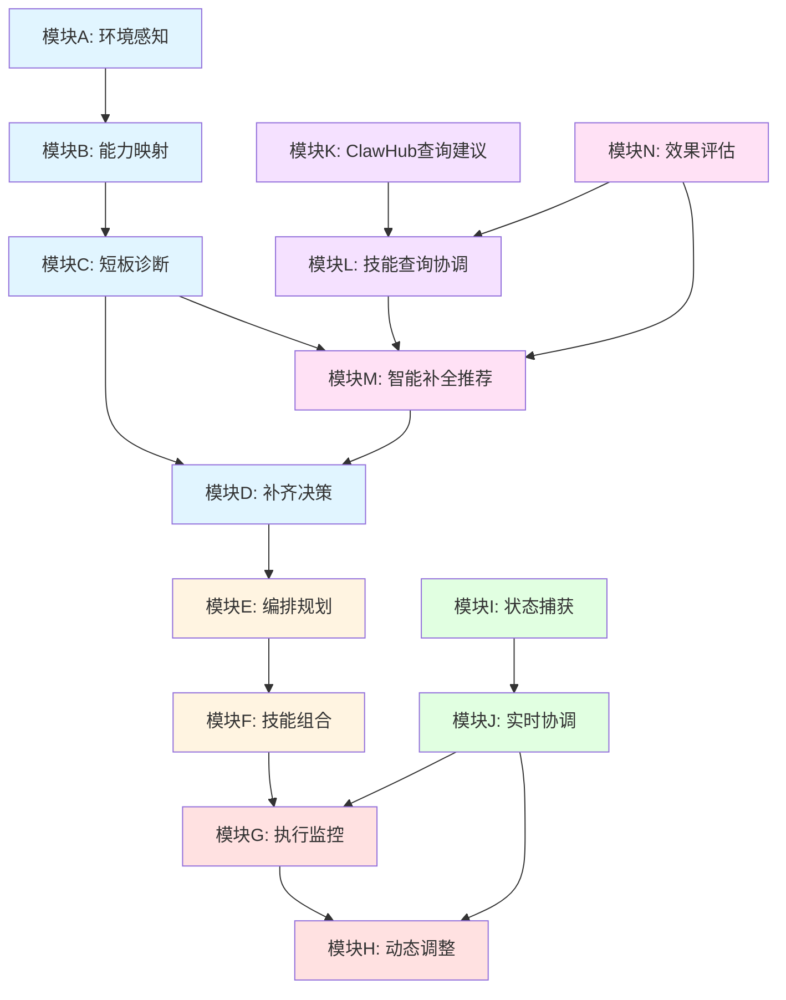
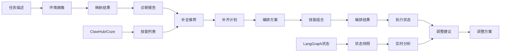
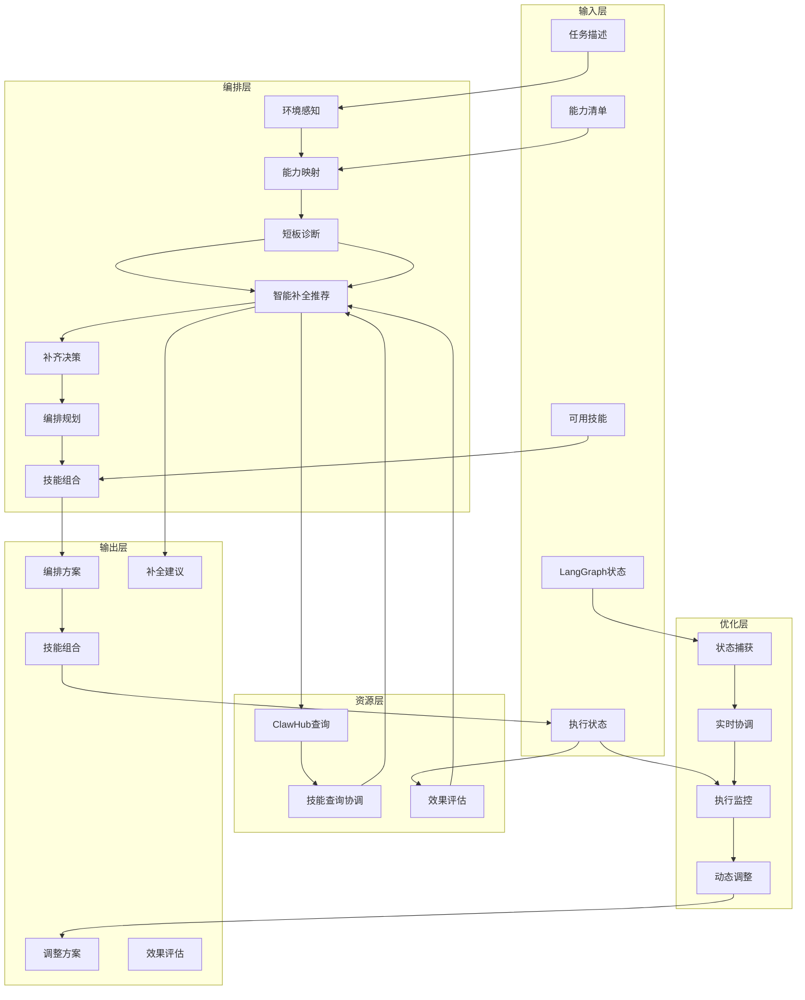
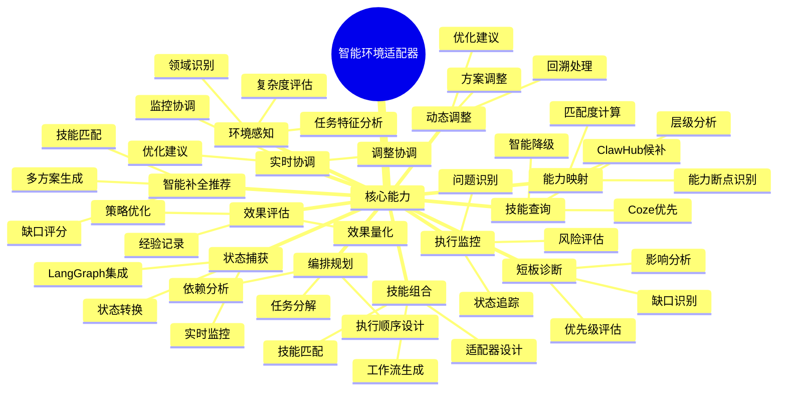
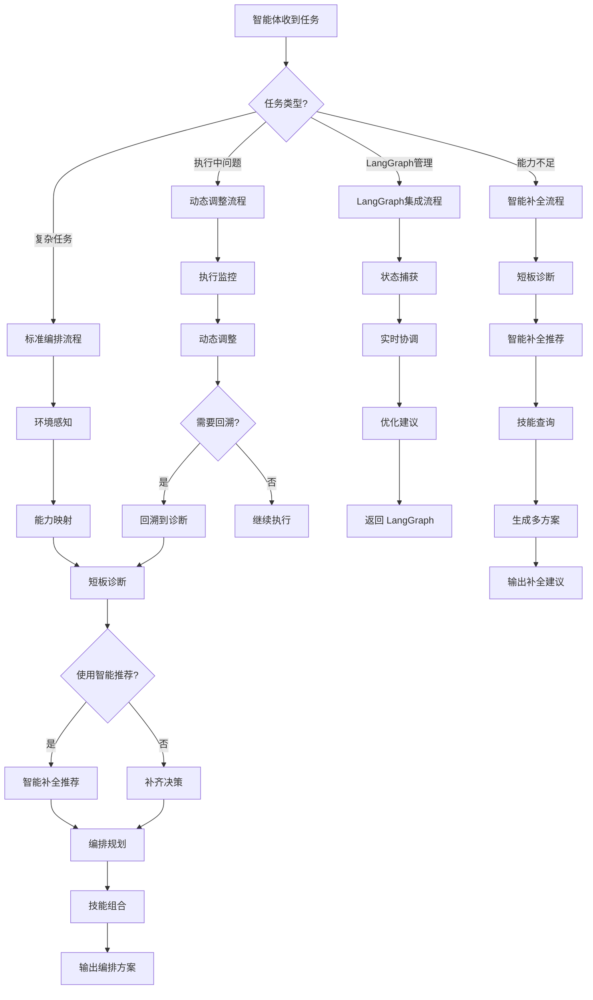

# 智能环境适配器 - 全局概览

## 目录

1. [架构概览](#架构概览)
2. [知识图谱](#知识图谱)
3. [模块详解](#模块详解)
4. [数据流](#数据流)
5. [使用场景](#使用场景)
6. [技术要点](#技术要点)
7. [最佳实践](#最佳实践)

---

## 架构概览

### 系统定位

**智能环境适配器**是一个智能化的技能编排方案生成系统，帮助 AI 智能体：

1. **分析任务特征**：理解任务需求，识别所需能力
2. **评估能力现状**：对比当前能力与任务需求的匹配度
3. **识别能力短板**：发现能力缺口，评估优先级
4. **智能补全推荐**：自动匹配技能，生成多方案推荐
5. **设计编排方案**：规划技能执行顺序和数据流
6. **生成技能组合**：输出可执行的技能组合
7. **监控执行状态**：实时监控，动态调整优化
8. **评估补全效果**：量化效果，持续学习优化

### 核心优势

| 优势 | 说明 |
|------|------|
| **智能化** | 自动匹配技能，智能推荐方案 |
| **模块化** | 14个功能模块，职责清晰，易于维护 |
| **可扩展** | 支持多技能源（Coze、ClawHub），支持 LangGraph 集成 |
| **可学习** | 完整闭环，持续积累经验，优化推荐 |
| **灵活性强** | 支持多种策略，多方案选择 |

### 技术架构

```
┌─────────────────────────────────────────────────────────────┐
│                     智能环境适配器                          │
├─────────────────────────────────────────────────────────────┤
│                                                              │
│  ┌──────────────┐  ┌──────────────┐  ┌──────────────┐      │
│  │  输入层      │  │  处理层      │  │  输出层      │      │
│  ├──────────────┤  ├──────────────┤  ├──────────────┤      │
│  │ 任务描述     │  │ 14个功能模块  │  │ 编排方案     │      │
│  │ 能力清单     │  │ - 感知       │  │ 技能组合     │      │
│  │ 可用技能     │  │ - 映射       │  │ 补全建议     │      │
│  │ 执行状态     │  │ - 诊断       │  │ 调整方案     │      │
│  │ LangGraph状态│  │ - 推荐       │  │ 效果评估     │      │
│  └──────────────┘  │ - 决策       │  └──────────────┘      │
│                    │ - 编排       │                       │
│                    │ - 组合       │                       │
│                    │ - 监控       │                       │
│                    │ - 调整       │                       │
│                    │ - 协调       │                       │
│                    └──────────────┘                       │
│                                                              │
│  ┌──────────────┐  ┌──────────────┐  ┌──────────────┐      │
│  │  外部集成    │  │  数据管理    │  │  学习系统    │      │
│  ├──────────────┤  ├──────────────┤  ├──────────────┤      │
│  │ Coze市场     │  │ JSON文件     │  │ 学习数据库   │      │
│  │ ClawHub      │  │ 缓存机制     │  │ 经验数据库   │      │
│  │ LangGraph    │  │ 格式验证     │  │ 权重调整     │      │
│  └──────────────┘  └──────────────┘  └──────────────┘      │
│                                                              │
└─────────────────────────────────────────────────────────────┘
```

---

## 知识图谱

### 1. 模块关系图谱



### 2. 数据流图谱



### 3. 功能架构图谱



### 4. 核心能力图谱



### 5. 使用场景图谱



---

## 模块详解

### 核心编排模块（A-F）

#### 模块A：环境感知
- **职责**：分析任务特征，生成环境画像
- **输入**：任务描述
- **输出**：environment_profile.json
- **核心功能**：
  - 任务类型识别（信息检索、深度分析、内容创作、问题解决）
  - 领域识别（金融、医疗、法律等）
  - 时效性判断（静态、实时、预测）
  - 复杂度评估（简单、中等、复杂、极复杂）

#### 模块B：能力映射
- **职责**：计算匹配度，识别能力断点
- **输入**：环境画像、能力清单
- **输出**：mapping_result.json
- **核心功能**：
  - 五层能力模型匹配（L1-L5）
  - 匹配度计算（0-1）
  - 能力断点识别
  - 层级得分分析

#### 模块C：短板诊断
- **职责**：生成详细诊断报告
- **输入**：映射结果、环境画像
- **输出**：diagnostic_report.json
- **核心功能**：
  - 缺口类型识别（知识缺口、数据源缺口、能力缺口等）
  - 缺口严重程度评估
  - 影响范围分析
  - 补齐建议方向

#### 模块M：智能补全推荐引擎 ⭐
- **职责**：深度分析缺口，智能匹配技能，生成多方案推荐
- **输入**：诊断报告、环境画像
- **输出**：remedy_recommendations.json
- **核心功能**：
  - 缺口优先级评估（影响范围40% + 紧急程度30% + 依赖关系20% + 难度10%）
  - 智能技能匹配（标签匹配60% + 描述相似度30% + 历史成功率10%）
  - 多方案生成（最优方案、备选方案、快速方案）
  - 实施路径规划（具体步骤、时间估算、成本评估）
- **技术要点**：
  - 集成技能查询协调器
  - 支持学习数据库
  - 自动过滤低匹配度技能

#### 模块D：补齐决策
- **职责**：选择补齐策略，生成计划
- **输入**：诊断报告、环境画像
- **输出**：remediation_plan.json
- **核心功能**：
  - 补齐策略选择（增量补全、替换补全、混合补全）
  - 补齐计划生成
  - 实施优先级排序

#### 模块E：编排规划
- **职责**：设计技能编排方案
- **输入**：补齐计划、环境画像
- **输出**：orchestration_plan.json
- **核心功能**：
  - 任务分解（子任务生成）
  - 技能依赖分析
  - 执行顺序设计（拓扑排序）
  - 数据流设计
  - 风险分析

#### 模块F：技能组合
- **职责**：生成可执行的技能组合
- **输入**：编排方案、可用技能
- **输出**：orchestration_result.json
- **核心功能**：
  - 技能匹配
  - 适配器设计
  - 工作流生成
  - 执行指南生成

### 动态优化模块（G-H）

#### 模块G：执行监控
- **职责**：接收执行状态，判断调整需求
- **输入**：执行状态、编排方案
- **输出**：adjustment_suggestion.json
- **核心功能**：
  - 状态追踪
  - 问题识别（简单/复杂/回溯）
  - 风险评估
  - 调整建议生成

#### 模块H：动态调整
- **职责**：生成调整方案
- **输入**：执行状态、调整建议、编排方案
- **输出**：adjustment_plan.json
- **核心功能**：
  - 方案调整
  - 回溯处理
  - 优化建议
  - 错误诊断

### LangGraph 集成模块（I-J）

#### 模块I：状态捕获适配器
- **职责**：接收 LangGraph 状态快照，转换格式
- **输入**：LangGraph 状态、当前节点、节点历史
- **输出**：state_snapshot.json
- **核心功能**：
  - 状态捕获
  - 格式转换
  - 执行指标计算
  - 状态查询接口

#### 模块J：实时分析协调器
- **职责**：协调监控和调整，生成优化建议
- **输入**：LangGraph 状态、当前节点、节点历史、编排方案
- **输出**：realtime_analysis_result.json
- **核心功能**：
  - 实时分析
  - 监控协调（调用模块G）
  - 调整协调（调用模块H）
  - 优化建议生成

### 技能资源模块（K-L）

#### 模块K：ClawHub 查询建议生成器
- **职责**：生成 ClawHub 查询建议方案（仅生成方案，不执行 API）
- **输入**：能力标签、领域、复杂度
- **输出**：ClawHubQuerySuggestion（查询建议对象）
- **核心功能**：
  - 根据能力标签生成扩展查询标签
  - 生成搜索关键词
  - 生成查询参数建议
  - 提供本地候补方案
  - 生成替代搜索建议
- **定位**：作为 Coze 的候补选项（优先级2），仅提供查询方案

#### 模块L：技能查询协调器
- **职责**：协调 Coze 和 ClawHub 查询，智能降级
- **输入**：能力标签、查询策略
- **输出**：query_result.json
- **核心功能**：
  - 多源查询（Coze、ClawHub）
  - 智能降级（Coze 不足时查询 ClawHub）
  - 去重和排序
  - 推荐建议生成
- **查询策略**：
  - coze_first（默认）：优先 Coze，不足时查询 ClawHub
  - coze_only：仅查询 Coze
  - clawhub_first：优先 ClawHub
  - all：同时查询所有来源

### 学习优化模块（N）

#### 模块N：补全效果评估器
- **职责**：评估补全效果，记录经验，优化推荐策略
- **输入**：补全前后状态、补全方案、执行结果
- **输出**：evaluation_report.json
- **核心功能**：
  - 效果量化评估
    - 能力匹配度提升
    - 任务完成率提升
    - 执行时间减少
    - 错误率降低
  - 成功判断（综合效果分数 >= 0.3）
  - 经验记录（成功案例、失败原因）
  - 策略优化（权重动态调整）
- **效果评估公式**：
  ```
  综合效果 = 0.4 × 能力匹配度提升
           + 0.3 × 任务完成率提升
           + 0.2 × 执行时间减少
           + 0.1 × 错误率降低
  ```

---

## 数据流

### 标准编排流程

```
任务描述
  ↓
[模块A] 环境感知
  ↓ 输出: environment_profile.json
[模块B] 能力映射
  ↓ 输出: mapping_result.json
[模块C] 短板诊断
  ↓ 输出: diagnostic_report.json
[模块M] 智能补全推荐 ← 集成技能查询协调器（模块L）
  ↓ 输出: remedy_recommendations.json
[模块D] 补齐决策
  ↓ 输出: remediation_plan.json
[模块E] 编排规划
  ↓ 输出: orchestration_plan.json
[模块F] 技能组合
  ↓ 输出: orchestration_result.json
输出给智能体
```

### 智能补全闭环

```
[模块C] 短板诊断
  ↓
[模块M] 智能补全推荐 ← 调用 [模块L] 技能查询协调器
  ↓ 生成3个方案（最优/备选/快速）
[模块D] 补齐决策
  ↓ 选择方案
实施补全
  ↓ 执行安装
[模块N] 效果评估
  ↓ 量化效果
记录经验
  ↓ 更新数据库
优化策略
  ↓ 调整权重
回到 [模块C]（持续优化）
```

### 动态调整流程

```
智能体执行
  ↓ 输出: execution_status.json
[模块G] 执行监控
  ↓ 输出: adjustment_suggestion.json
[模块H] 动态调整
  ↓ 输出: adjustment_plan.json 或 revisit_request.json
智能体继续执行 或 回溯
```

### LangGraph 集成流程

```
LangGraph 执行
  ↓
[模块I] 状态捕获
  ↓ 输出: state_snapshot.json
[模块J] 实时分析协调器
  ↓ 调用 [模块G] 执行监控 + [模块H] 动态调整
  ↓ 输出: realtime_analysis_result.json
返回优化建议给 LangGraph
```

### 技能查询流程

```
能力标签
  ↓
[模块L] 技能查询协调器
  ↓
优先查询 Coze 技能市场
  ↓ 判断: 是否充足?
  ↓ 是
  ↓ 否
查询 ClawHub
  ↓
去重和排序（优先级: Coze > ClawHub）
  ↓
输出: aggregated_skills.json
```

---

## 使用场景

### 场景1：复杂任务编排

**适用情况**：智能体收到复杂任务，需要评估能力并设计编排方案

**流程**：
1. 环境感知：分析任务特征
2. 能力映射：评估当前能力匹配度
3. 短板诊断：识别能力缺口
4. 智能补全推荐：生成多方案推荐
5. 编排规划：设计技能执行方案
6. 技能组合：生成可执行的技能组合

**预期结果**：
- 完整的技能编排方案
- 明确的能力补全建议
- 可执行的工作流

### 场景2：执行中动态调整

**适用情况**：执行过程中遇到问题，需要动态调整方案

**流程**：
1. 执行监控：追踪执行状态
2. 问题识别：判断问题类型
3. 动态调整：生成调整方案
4. 继续执行或回溯

**预期结果**：
- 实时优化建议
- 调整方案或回溯建议
- 减少执行失败

### 场景3：LangGraph 深度集成

**适用情况**：使用 LangGraph 管理工作流，需要实时状态感知和优化

**流程**：
1. 状态捕获：捕获 LangGraph 执行状态
2. 实时分析：分析状态并生成优化建议
3. 动态调整：返回调整方案给 LangGraph

**预期结果**：
- 实时状态可视化
- 动态优化能力
- 智能回溯机制

### 场景4：能力补全推荐

**适用情况**：识别到能力缺口，需要智能推荐技能

**流程**：
1. 短板诊断：识别能力缺口
2. 智能补全推荐：生成多方案推荐
3. 技能查询：查询 Coze 和 ClawHub
4. 效果评估：评估补全效果

**预期结果**：
- 多个备选方案（最优/备选/快速）
- 具体的实施步骤
- 量化的预期效果

---

## 技术要点

### 缺口评分模型

```
优先级分数 = 0.4 × 影响范围
           + 0.3 × 紧急程度
           + 0.2 × 依赖关系
           + 0.1 × (1.0 - 补全难度)
```

### 技能匹配算法

```
匹配度 = 0.6 × 标签匹配度
       + 0.3 × 描述相似度
       + 0.1 × 历史成功率
```

### 效果评估指标

```
综合效果 = 0.4 × 能力匹配度提升
         + 0.3 × 任务完成率提升
         + 0.2 × 执行时间减少
         + 0.1 × 错误率降低
```

### 学习机制

- **探索与利用平衡**：80% 利用已知有效方案，20% 尝试新方案
- **权重动态调整**：
  - 成功率 < 50%：权重降至 0.5
  - 成功率 > 80% 且效果好：权重提升至 1.2
  - 其他：保持权重 1.0
- **经验定期清理**：删除超过 6 个月的过时数据

### 技能查询优先级

```
Coze 技能市场（优先级1）
  ↓ 不足或不可用
ClawHub（优先级2）
  ↓
去重和排序
  ↓
输出聚合结果
```

---

## 最佳实践

### 1. 推荐使用模块M替代模块D

**原因**：模块M提供智能化、多方案的补全推荐，比模块D的通用建议更精准

**对比**：
- 模块D：静态规则，单一方案
- 模块M：动态智能，多方案（最优/备选/快速）

### 2. 集成学习数据库

**建议**：
- 定期更新学习数据库（`learning_database.json`）
- 记录每次补全的效果（使用模块N）
- 基于历史数据优化推荐

### 3. 优先使用 Coze 技能

**原则**：
- Coze 技能市场优先（官方、兼容性好）
- ClawHub 作为候补（扩大技能池）
- 查询策略使用 `coze_first`

### 4. LangGraph 集成建议

**建议**：
- 使用模块I和J实现实时监控
- 在关键节点后添加实时检查
- 支持智能回溯机制

### 5. 数据格式标准化

**要求**：
- 所有数据文件使用 JSON 格式
- 遵循 `references/data_formats.md` 的规范
- 使用验证工具确保格式正确

### 6. 错误处理与容错

**策略**：
- 每个模块都有降级方案
- 确保流程不中断
- 提供清晰的错误信息

### 7. 性能优化

**建议**：
- 使用缓存机制（技能查询结果缓存1小时）
- 异步查询外部技能源
- 超时控制（10秒超时）

---

## 附录

### 模块脚本位置

所有模块位于 `scripts/modules/` 目录：
- `environment_perceiver.py`
- `capability_mapper.py`
- `shortage_diagnoser.py`
- `intelligent_remedy_recommender.py` ⭐
- `remediation_decider.py`
- `orchestration_planner.py`
- `skill_composer.py`
- `execution_monitor.py`
- `dynamic_adjuster.py`
- `state_capture_adapter.py`
- `realtime_coordinator.py`
- `clawhub_querier.py`
- `skill_query_coordinator.py`
- `remediation_effectiveness_evaluator.py`

### 数据文件示例

- `environment_profile.json`：环境画像
- `mapping_result.json`：映射结果
- `diagnostic_report.json`：诊断报告
- `remedy_recommendations.json`：补全推荐
- `orchestration_plan.json`：编排方案
- `orchestration_result.json`：技能组合
- `adjustment_suggestion.json`：调整建议
- `adjustment_plan.json`：调整方案
- `state_snapshot.json`：状态快照
- `realtime_analysis_result.json`：实时分析结果
- `learning_database.json`：学习数据库
- `lessons_database.json`：经验数据库

### 相关文档

- `SKILL.md`：快速开始和使用指南
- `references/capability_layers.md`：五层能力模型
- `references/data_formats.md`：数据格式规范
- `references/remediation_strategies.md`：补齐策略说明
- `references/orchestration_patterns.md`：编排模式参考
- `references/module_specs/overview.md`：模块规范概览

---

**文档版本**：v1.0
**最后更新**：2025-04-06
**维护者**：智能环境适配器团队
