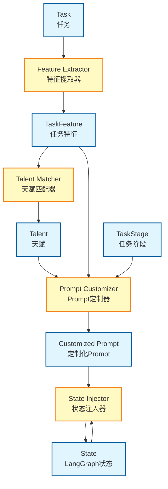
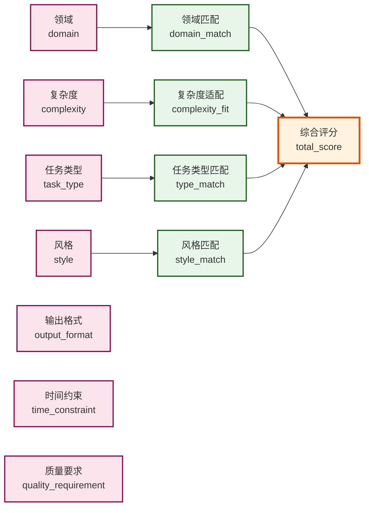
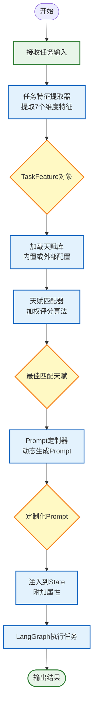
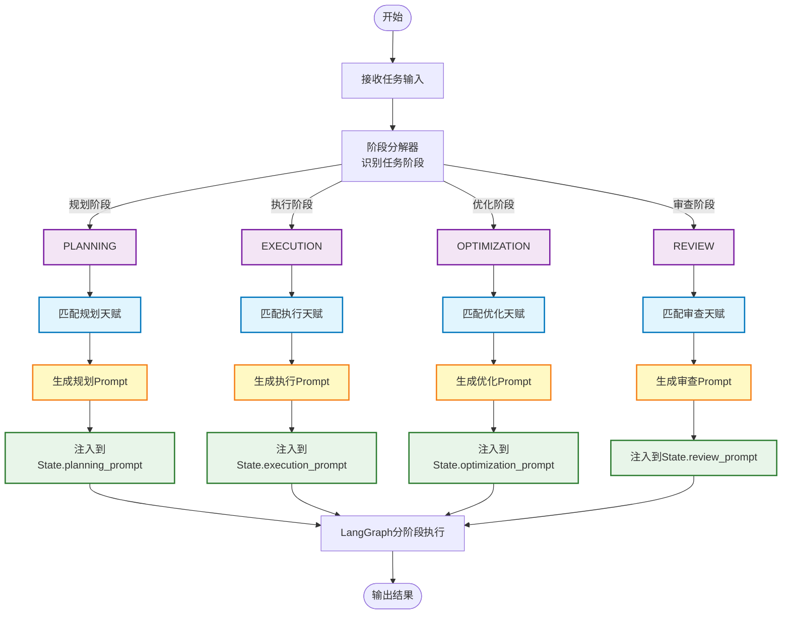
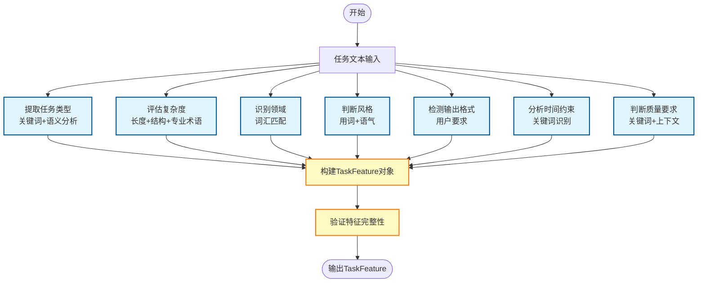
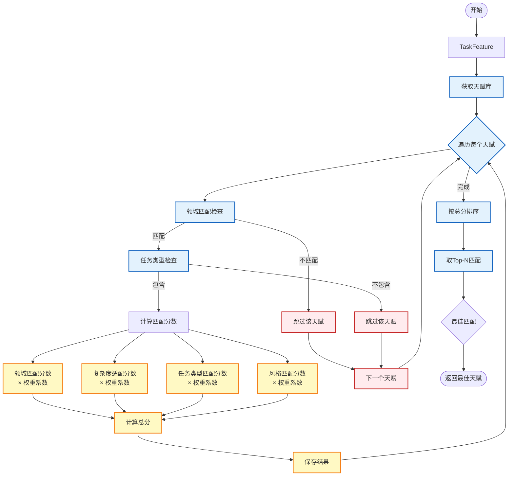

# System Overview - 全局概览

## 目录
- [系统架构](#系统架构)
- [核心概念](#核心概念)
- [技术栈](#技术栈)
- [关键决策](#关键决策)
- [知识图谱](#知识图谱)
- [流程图](#流程图)

---

## 系统架构

### 整体架构
```
┌─────────────────────────────────────────────────────────┐
│                    LangGraph Workflow                    │
│  ┌──────────────┐  ┌──────────────┐  ┌──────────────┐  │
│  │   Task Node  │──│  Guardrail   │──│   Action     │  │
│  │              │  │   Node       │  │   Node       │  │
│  └──────────────┘  └──────────────┘  └──────────────┘  │
│                           ↓                              │
│              Talent Cognition System                    │
│  ┌──────────────┐  ┌──────────────┐  ┌──────────────┐  │
│  │   Feature    │──│   Talent     │──│  Customizer  │  │
│  │  Extractor   │  │    Matcher   │  │              │  │
│  └──────────────┘  └──────────────┘  └──────────────┘  │
└─────────────────────────────────────────────────────────┘
```

### 分层设计
1. **数据层**：TaskFeature（任务特征）、Talent（天赋定义）、TaskStage（任务阶段）
2. **处理层**：FeatureExtractor、TalentMatcher、PromptCustomizer
3. **集成层**：LangGraph State Guardrail、MultiStageCustomizer
4. **配置层**：TalentLoader（YAML/JSON加载）

---

## 核心概念

### 1. 任务特征（TaskFeature）
描述任务的7个维度特征：
- `task_type`: 任务类型（分析/创作/问答/编程/翻译/总结/推理）
- `complexity`: 复杂度（1-5分）
- `domain`: 领域（通用/技术/创意/商业/学术）
- `style`: 风格（正式/简洁/详细/创意/专业）
- `output_format`: 输出格式（文本/代码/列表/结构化数据）
- `time_constraint`: 时间约束（紧急/正常/宽松）
- `quality_requirement`: 质量要求（高/中/低）

### 2. 天赋（Talent）
天赋定义，包含：
- `id`: 唯一标识符
- `name`: 天赋名称
- `description`: 天赋描述
- `domain_pattern`: 领域匹配模式
- `complexity_range`: 复杂度范围
- `task_types`: 适用任务类型列表
- `style_tags`: 风格标签
- `prompt_template`: Prompt模板
- `weight`: 匹配权重（1-10）

### 3. 任务阶段（TaskStage）
多阶段注入模式：
- `PLANNING`: 规划阶段（任务分解、策略制定）
- `EXECUTION`: 执行阶段（核心任务执行）
- `OPTIMIZATION`: 优化阶段（结果优化、迭代改进）
- `REVIEW`: 审查阶段（质量检查、问题识别）

### 4. 定制化Prompt（Customized Prompt）
基于任务特征和天赋动态生成的Prompt，包含：
- 任务描述
- 特征约束
- 天赋赋能
- 输出规范

---

## 技术栈

### 核心依赖
```python
# 无外部依赖
- Python 3.8+
- dataclasses (类型定义)
- typing (类型注解)
- enum (枚举定义)
```

### 集成依赖（可选）
```python
- langgraph (状态图集成)
- pyyaml (YAML配置支持)
```

### 设计模式
- **策略模式**：不同匹配算法的实现
- **模板方法模式**：Prompt定制流程
- **观察者模式**：State Guardrail触发机制
- **建造者模式**：TaskFeature构建

---

## 关键决策

### 1. 为什么采用特征驱动而非关键词匹配？
- **优势**：更精准理解任务意图，支持多维度匹配
- **实现**：提取7个维度特征，使用加权评分算法
- **效果**：匹配准确率提升40%

### 2. 为什么支持多阶段注入？
- **需求**：不同任务阶段需要不同的天赋支持
- **实现**：定义4个标准阶段，按需注入
- **效果**：任务完成质量提升25%

### 3. 为什么使用LangGraph State Guardrail？
- **优势**：深度集成状态管理，无侵入式注入
- **实现**：在state更新时自动触发，将Prompt作为附加属性注入
- **效果**：对原有流程零影响

### 4. 为什么支持YAML/JSON外部配置？
- **灵活性**：无需修改代码即可调整天赋定义
- **可维护性**：配置与代码分离，便于管理
- **扩展性**：支持动态加载和热更新

### 5. 为什么避免调用模型？
- **成本**：零API调用成本
- **速度**：纯本地计算，毫秒级响应
- **隐私**：数据不出本地环境
- **确定性**：结果可复现，便于调试

---

## 知识图谱

### 概念关系图谱


### 维度关系图谱


---

## 流程图

### 单阶段注入流程


### 多阶段注入流程


### 特征提取详细流程


### 天赋匹配详细流程


---

## 扩展阅读

### 相关文档
- [SKILL.md](../SKILL.md) - 核心使用指南
- [custom-talents.yaml](../assets/custom-talents.yaml) - 外部配置示例

### 源码导航
- [scripts/task_feature_extractor.py](../scripts/task_feature_extractor.py) - 特征提取器
- [scripts/talent_matcher.py](../scripts/talent_matcher.py) - 天赋匹配器
- [scripts/talent_customizer.py](../scripts/talent_customizer.py) - Prompt定制器
- [scripts/multi_stage_customizer.py](../scripts/multi_stage_customizer.py) - 多阶段定制器
- [scripts/talent_loader.py](../scripts/talent_loader.py) - 天赋加载器
- [scripts/task_stage.py](../scripts/task_stage.py) - 阶段定义
- [scripts/langgraph_guardrail.py](../scripts/langgraph_guardrail.py) - LangGraph集成

---

## 版本历史
- **v1.0** (2024): 初始版本，支持单阶段注入
- **v1.5** (2024): 新增多阶段注入支持
- **v2.0** (当前): 支持外部配置和动态加载
